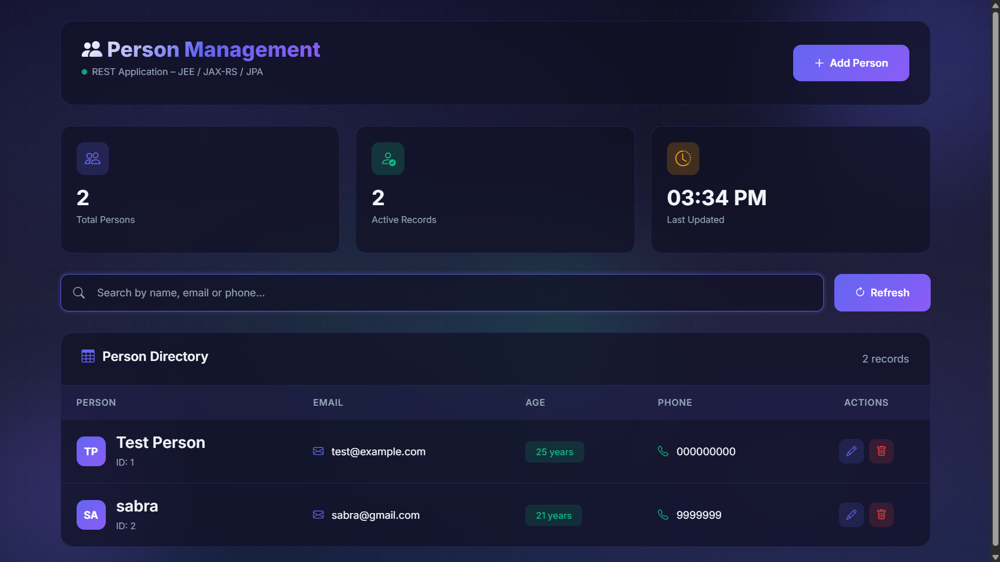
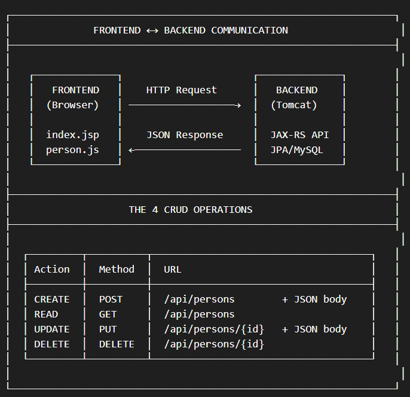
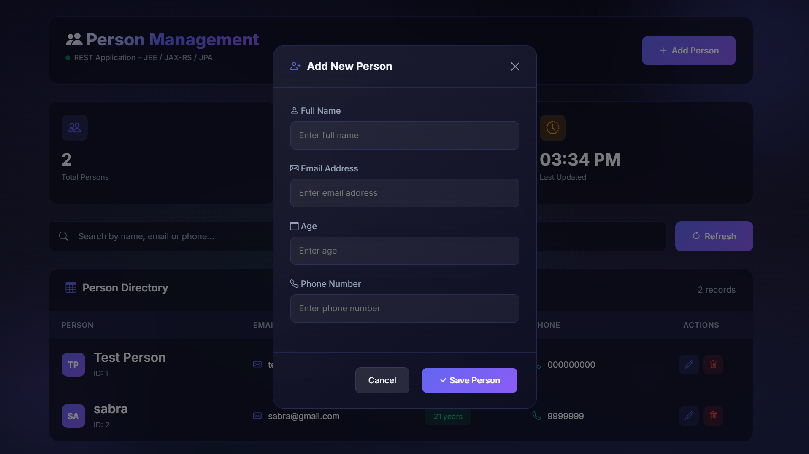
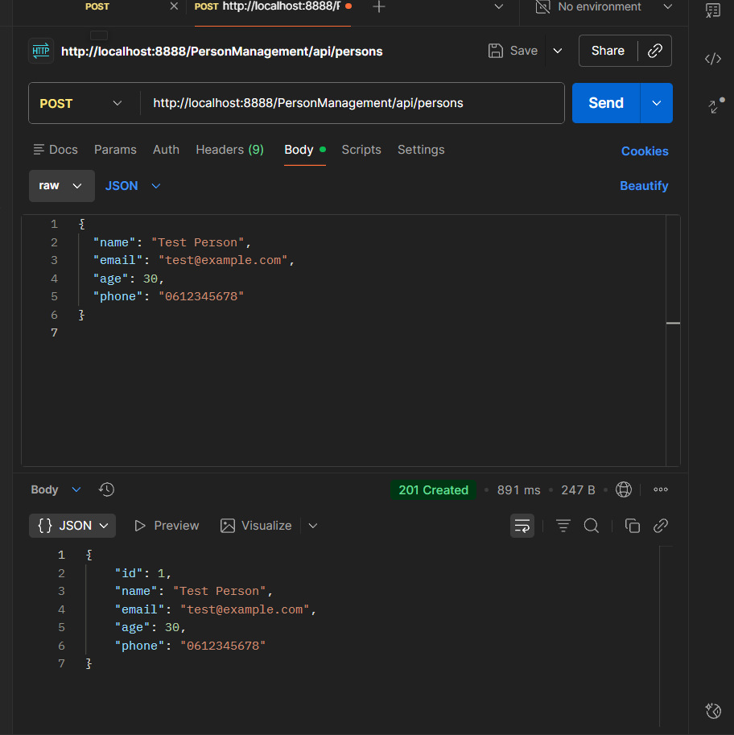
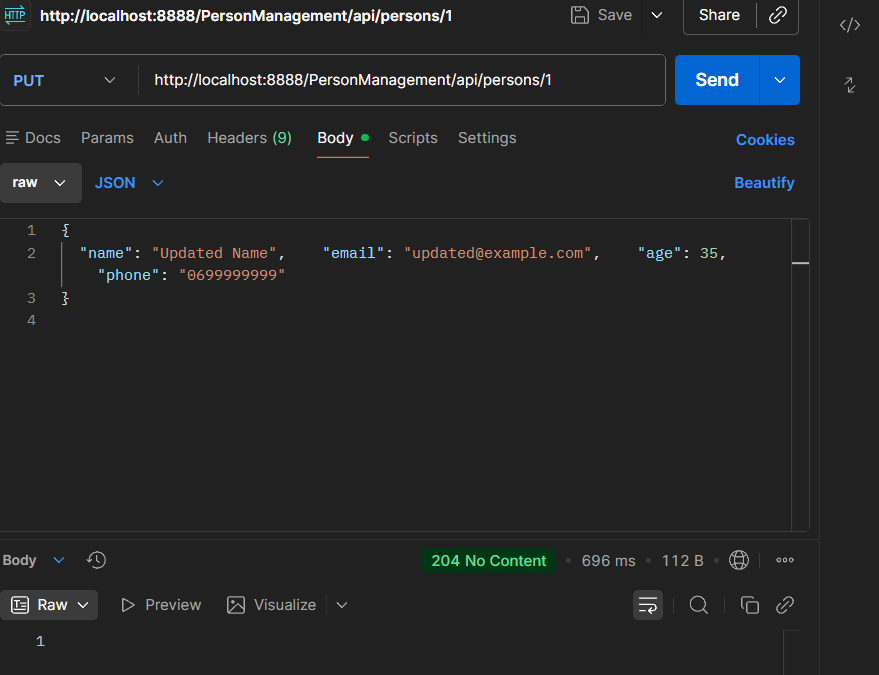
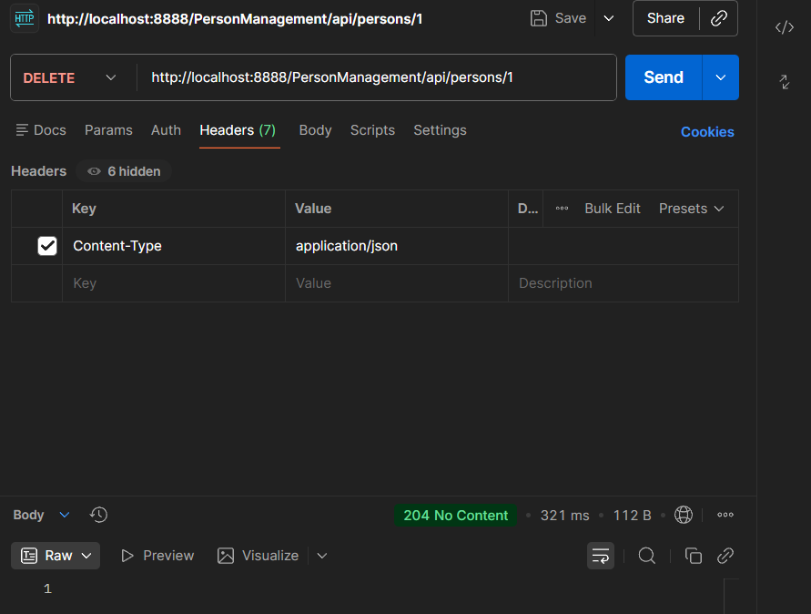

# person-management-frontend

Person Management REST Application - JEE Project

# 🧑‍💼 Person Management System - Frontend

Une interface web moderne pour gérer des personnes via une API RESTful JAX-RS.



---

## 📋 Table des matières

- [À propos du projet](#à-propos-du-projet)
- [Technologies utilisées](#technologies-utilisées)
- [Fonctionnalités](#fonctionnalités)
- [Architecture](#architecture)
- [Installation](#installation)
- [Captures d'écran](#captures-décran)
- [Tests API avec Postman](#tests-api-avec-postman)
- [Vidéo de démonstration](#vidéo-de-démonstration)
- [Auteur](#auteur)

---

## 📖 À propos du projet

Application frontend en JSP qui consomme un backend REST (JAX-RS + JPA/Hibernate) pour la gestion complète des personnes (opérations CRUD).

**Contexte pédagogique** : Projet JEE – Développement du frontend consommant les services REST vus en TP.

---

## 🛠️ Technologies utilisées

### Frontend

| Technologie      | Rôle                              |
| ---------------- | --------------------------------- |
| **JSP**          | Pages dynamiques                  |
| **HTML5 / CSS3** | Structure et style                |
| **JavaScript**   | Logique client (Fetch API)        |
| **Fetch API**    | Appels REST (GET/POST/PUT/DELETE) |

### Backend

| Technologie     | Rôle                  |
| --------------- | --------------------- |
| JAX-RS (Jersey) | API REST              |
| JPA / Hibernate | Accès base de données |
| MySQL /         | Base persondb         |
| Tomcat 9        | Serveur               |

---

## ✨ Fonctionnalités

- Liste des personnes
- Ajout d’une personne (formulaire)
- Modification d’une personne
- Suppression avec confirmation
- Recherche
- Communication exclusive via REST (JSON)

---

## 🏗️ Architecture



---

## 🚀 Installation

### Prérequis

- JDK 8 ou supérieur
- Apache Tomcat 9.0
- MySQL / MariaDB (base `persondb`)
- Eclipse IDE avec support serveur Tomcat

### Étapes détaillées

1. Cloner le dépôt :
   ```bash
   git clone https://github.com/sindaxshm/person-management-frontend.git
   ```

### Importer dans Eclipse

1. File → Import → General → Existing Projects into Workspace
2. Sélectionner le dossier du projet cloné
3. Cocher _Detect and configure project natures_ si proposé
4. Finish

### Configurer Tomcat 9

1. Window → Show View → Servers
2. Clic droit → New → Server → Apache → Tomcat v9.0 Server
3. Ajouter le projet _PersonManagement_ au serveur

### Lancer le serveur

👉 [http://localhost:8888/PersonManagement/](http://localhost:8888/PersonManagement/)

---

## 📸 Captures d'écran

- Interface principale  
  

- Formulaire ajout/modification  
  

- Recherche  
  

---

## 🧪 Tests API avec Postman

- **POST (création)**  
  

- **PUT (modification)**  
  

- **DELETE (suppression)**  
  

---

## 🎥 Vidéo de démonstration

📌 [Voir la vidéo sur Google Drive](https://drive.google.com/file/d/1BwL_xxr29jQkaQ45boHKd32twjR0p9_w/view?usp=sharing)

---

## 👤 Auteur

- **Sinda Sahmim tp3**
- GitHub : [@sindaxshm](https://github.com/sindaxshm)
